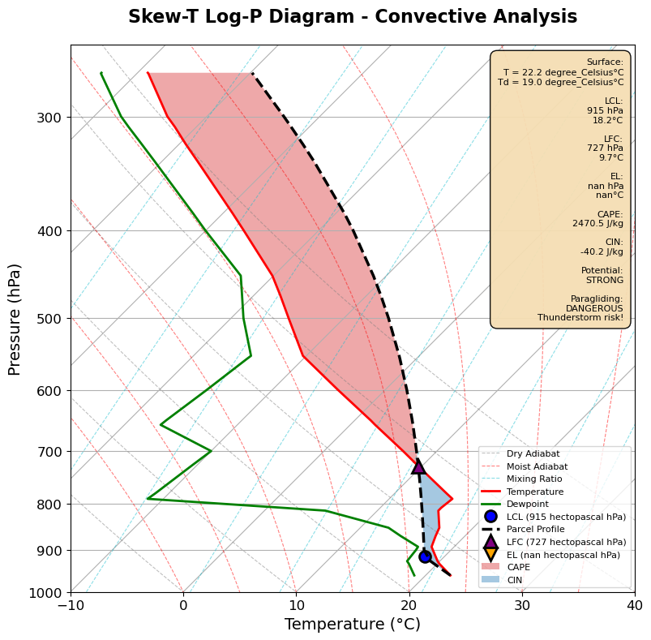

# Convective Risk Analyzer

**[🔴 Live Demo](https://convective-risk-analyzer.streamlit.app)** *(Deploy after setup)*

This project provides real-time convective potential assessment for aviation safety operations. Using atmospheric sounding data and MetPy thermodynamic calculations, it computes CAPE (Convective Available Potential Energy) and CIN (Convective Inhibition) to evaluate severe weather risk across multiple aviation stakeholder categories.

The analysis translates complex atmospheric instability metrics into actionable go/no-go decisions for paragliding, hang gliding, hot air ballooning, sailplane operations, and general aviation, with visual Skew-T Log-P diagrams showing the complete thermodynamic environment.

## The Analysis

The core analysis processes atmospheric soundings through the following workflow:

1. **Data Ingestion:** Reads sounding data from Wyoming format, CSV files, or manual entry with pressure, temperature, and dewpoint profiles.
2. **Thermodynamic Calculations:** Computes Lifting Condensation Level (LCL), Level of Free Convection (LFC), and Equilibrium Level (EL) using MetPy.
3. **Parcel Theory:** Calculates the theoretical temperature profile of a rising air parcel following dry and moist adiabatic processes.
4. **Energy Analysis:** Integrates buoyancy to compute CAPE (energy available for convection) and CIN (inhibition barrier).
5. **Risk Classification:** Applies multi-stakeholder decision frameworks based on convective indices, accounting for operational characteristics of each aviation activity.
6. **Visualization:** Generates professional Skew-T diagrams with shaded CAPE/CIN regions and annotated critical levels.

**Key Innovation:** Unlike generic convective analysis tools, this platform differentiates risk assessment across five distinct aviation stakeholder categories, recognizing that a "dangerous" sounding for paragliders may be "excellent" for sailplane cross-country flight.

## Results

### Convective Indices

For each atmospheric sounding, the analysis computes:

| Index | Description | Units | Interpretation |
| :--- | :--- | :---: | :--- |
| **CAPE** | Convective Available Potential Energy | J/kg | Energy available for storm development |
| **CIN** | Convective Inhibition | J/kg | Energy barrier preventing convection |
| **LCL** | Lifting Condensation Level | hPa | Cloud base height |
| **LFC** | Level of Free Convection | hPa | Height where parcel becomes buoyant |
| **EL** | Equilibrium Level | hPa | Top of convective cloud |

**Convective Potential Classification:**
- CAPE < 300 J/kg: **WEAK** - Minimal convective activity
- CAPE 300-1000 J/kg: **MODERATE** - Scattered convection possible
- CAPE 1000-2500 J/kg: **STRONG** - Organized thunderstorms likely
- CAPE > 2500 J/kg: **EXTREME** - Severe weather probable

### Risk Assessment Framework

The platform provides tailored risk analysis for five aviation stakeholder categories:

#### 1. Paragliding
**Most Conservative:** Vulnerable to turbulence and vertical development
- High CIN (>200 J/kg): GO - Strong cap provides safety
- Moderate CIN (50-200 J/kg): GO - Acceptable with monitoring
- Low CIN + High CAPE (>1000 J/kg): NO-GO - Thunderstorm risk

#### 2. Hang Gliding
**Moderately Conservative:** Higher wing loading provides more stability than paragliders
- Similar criteria to paragliding but one risk level lower
- Can tolerate moderate convection that grounds paragliders

#### 3. Hot Air Balloon
**Extremely Conservative:** No ability to escape convective conditions
- Any CAPE > 500 J/kg: NO-GO
- Sunrise operations only when CAPE > 200 J/kg
- Most restrictive decision criteria

#### 4. Gliding (Sailplanes)
**Moderate Risk Tolerance:** Seeks convection for lift but avoids storms
- CAPE 300-1000 J/kg with CIN > 100: GO - Excellent XC conditions
- CAPE > 2500 J/kg: NO-GO - Storm development likely
- Balance between lift availability and storm risk

#### 5. General Aviation (VFR)
**Risk-Aware:** Focuses on embedded thunderstorm avoidance
- CAPE < 500 J/kg: GO - Good VFR conditions
- CAPE 500-1500 J/kg: GO with caution - Monitor radar
- CAPE > 1500 J/kg: NO-GO - IFR recommended

### Output Visualizations

The analysis generates comprehensive aviation safety products:

#### 1. Skew-T Log-P Diagram


Professional thermodynamic diagram showing:
- Temperature and dewpoint profiles (red/green lines)
- Parcel path following adiabatic processes (black dashed)
- Critical levels marked (LCL, LFC, EL)
- CAPE region shaded (positive buoyancy - red)
- CIN region shaded (negative buoyancy - blue)

#### 2. Multi-Stakeholder Risk Dashboard
Interactive web interface displaying:
- Real-time go/no-go decisions for all five aviation categories
- Color-coded risk levels (GREEN=Minimal, YELLOW=Low, ORANGE=Moderate, RED=High, DARK_RED=Extreme)
- Specific operational precautions tailored to each activity
- Reasoning behind each risk classification

#### 3. Export Products
- **JSON:** Complete analysis results for integration with other systems
- **CSV:** Tabular convective indices for record-keeping
- **PNG:** High-resolution Skew-T diagrams for briefings

## Project Structure

```
convective-risk-analyzer/
├── README.md                      # This file
├── requirements.txt               # Python dependencies
├── app.py                         # Streamlit web application
├── convective_engine.py           # Core thermodynamic calculations
├── risk_assessment.py             # Multi-stakeholder risk logic
├── data_loader.py                 # Flexible data ingestion
├── outputs/                       # Example outputs
│   └── skewt_example.png
└── data/                          # Example soundings
    ├── unstable_example.txt       # Wyoming format example
    └── stable_example.csv         # CSV format example
```

## Technology Used

* **Python 3.11+**
* **MetPy:** For meteorological calculations and Skew-T plotting
* **NumPy:** For numerical array operations
* **Pandas:** For data manipulation
* **Matplotlib:** For publication-quality plotting
* **Streamlit:** For interactive web application
* **Plotly:** For enhanced interactivity (optional)

## Business Applications

This analysis has practical applications in:

- **Aviation Operations:** Pre-flight convective risk assessment for flight schools, commercial operators, and competition organizers
- **Outdoor Event Planning:** Weather risk evaluation for festivals, sporting events, and outdoor activities
- **Agricultural Aviation:** Spray operation timing to avoid convective turbulence
- **Emergency Management:** Severe weather forecasting and public safety decisions
- **Insurance/Risk Management:** Objective weather risk quantification for underwriting

**Target Markets:**
- Flight training organizations (paragliding/hang gliding schools)
- Soaring clubs and competition organizers
- Hot air balloon commercial operators
- Agricultural aviation services
- Event management companies
- Weather service providers

## How to Use

### Option 1: Web Application (Recommended)

1. **Clone the repository:**
   ```bash
   git clone https://github.com/yourusername/convective-risk-analyzer.git
   cd convective-risk-analyzer
   ```

2. **Create and activate a virtual environment:**
   ```bash
   python -m venv venv
   source venv/bin/activate  # On Windows: venv\Scripts\activate
   ```

3. **Install dependencies:**
   ```bash
   pip install -r requirements.txt
   ```

4. **Run the web application:**
   ```bash
   streamlit run app.py
   ```
   
   Open your browser to `http://localhost:8501`. Upload a sounding file (Wyoming or CSV format) or click **"Use Example Data"** for instant demonstration.

**💡 Tip:** The example sounding shows an EXTREME convective scenario (CAPE > 4000 J/kg) to demonstrate the full risk assessment framework across all stakeholder categories.

### Option 2: Python Module

```python
from data_loader import SoundingLoader
from convective_engine import ConvectiveAnalyzer
from risk_assessment import RiskAssessor

# Load sounding data
sounding = SoundingLoader.from_wyoming('your_sounding.txt')

# Analyze convective potential
analyzer = ConvectiveAnalyzer(sounding)
indices = analyzer.calculate_indices()

# Assess risks
assessor = RiskAssessor(indices)
assessment = assessor.assess_all()

# Check paragliding conditions
print(f"Paragliding: {assessment.paragliding.risk_level.value}")
print(f"Decision: {'GO' if assessment.paragliding.go_no_go else 'NO-GO'}")
print(f"Reasoning: {assessment.paragliding.reasoning}")
```

### Option 3: Quick Analysis Function

```python
from convective_engine import quick_analysis
import numpy as np

# Define sounding
pressure = np.array([1000, 950, 900, 850, 800, 700, 500])
temperature = np.array([28, 24, 20, 16, 12, 4, -12])
dewpoint = np.array([22, 18, 14, 10, 6, -2, -20])

# Get indices
indices = quick_analysis(pressure, temperature, dewpoint)
print(f"CAPE: {indices.cape:.0f} J/kg")
print(f"CIN: {indices.cin:.0f} J/kg")
```

## Data Format

### Wyoming Format (University of Wyoming Sounding Archive)
```
PRES   HGHT   TEMP   DWPT   RELH   MIXR   DRCT   SKNT
 hPa     m      C      C      %    g/kg    deg   knot
1000    104   28.0   22.0     69  17.05    180     10
 975    305   26.0   20.0     69  14.95    185     12
 950    511   24.0   18.0     68  13.08    190     14
```

Required columns: `PRES`, `TEMP`, `DWPT`

**Data source:** [University of Wyoming Upper Air Archive](http://weather.uwyo.edu/upperair/sounding.html)

### CSV Format
```
pressure,temperature,dewpoint
1000,28,22
975,26,20
950,24,18
```

Required columns: `pressure` (hPa), `temperature` (°C), `dewpoint` (°C)

### Sample Data Included

Example soundings provided for testing:
- `unstable_example.txt`: High CAPE scenario (severe weather)
- `stable_example.csv`: Stable atmosphere with strong cap

## Scientific Background

The convective analysis follows standard atmospheric thermodynamics:

**Parcel Theory:** An air parcel lifted adiabatically will cool at approximately 9.8°C/km (dry adiabatic lapse rate) until saturation, then ~6°C/km (moist adiabatic lapse rate) while condensing moisture.

**CAPE Calculation:** Positive area between parcel temperature and environment temperature:
```
CAPE = g ∫[LFC to EL] (T_parcel - T_env) / T_env dz
```

**Risk Framework:** Decision criteria based on:
- Historical accident analysis (aviation safety databases)
- Operational characteristics (wing loading, climb performance, maneuverability)
- Regulatory guidance (FAA, EASA, national hang gliding/paragliding associations)

**References:**
- Doswell & Rasmussen (1994): "The Effect of Neglecting the Virtual Temperature Correction on CAPE Calculations"
- Thompson et al. (2003): "Close Proximity Soundings within Supercell Environments"
- National Weather Service Severe Weather Forecasting Guidelines

## Deployment

### Streamlit Cloud (Free)

1. **Push to GitHub** (make repository public or connect Streamlit to private repos)

2. **Deploy on Streamlit Cloud:**
   - Go to [share.streamlit.io](https://share.streamlit.io)
   - Click "New app"
   - Select your repository
   - Set main file: `app.py`
   - Click "Deploy"

3. **Update README** with your live demo URL

### Local Deployment

```bash
streamlit run app.py --server.port 8501
```

## Contributing

Contributions welcome for:
- Additional aviation stakeholder categories (drones, helicopters, military operations)
- Integration with live weather data sources (NOAA, MetOffice)
- Historical sounding database for climatological analysis
- Machine learning enhancement for risk prediction
- Mobile-responsive UI improvements

## License

MIT License - See LICENSE file for details.

## Acknowledgments

- University of Wyoming for sounding data archive
- MetPy development team for meteorological Python tools
- Aviation safety organizations for operational guidance
- Physical meteorology community for thermodynamic standards

---

**Author:** João - Meteorology Student | Data Science Portfolio Project  
**Contact:** [Your GitHub/LinkedIn]  
**Part of data science career transition portfolio focusing on remote-first opportunities**
